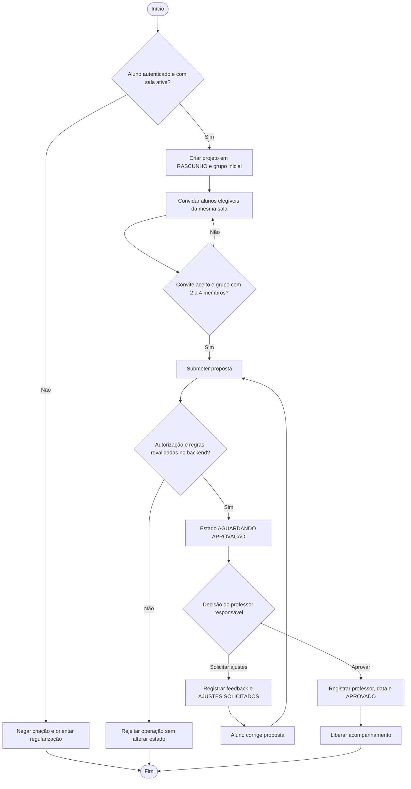
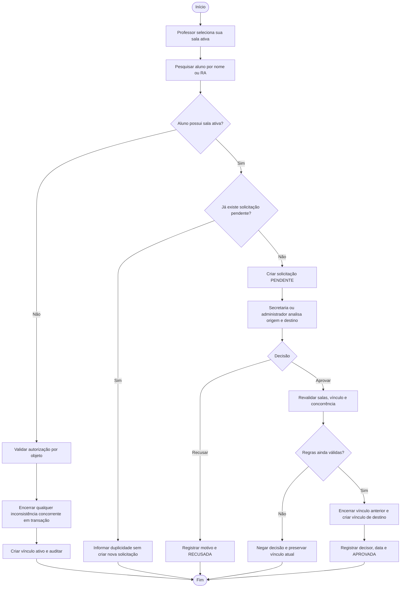
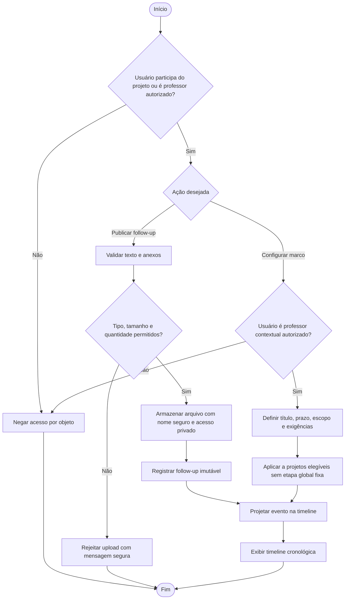
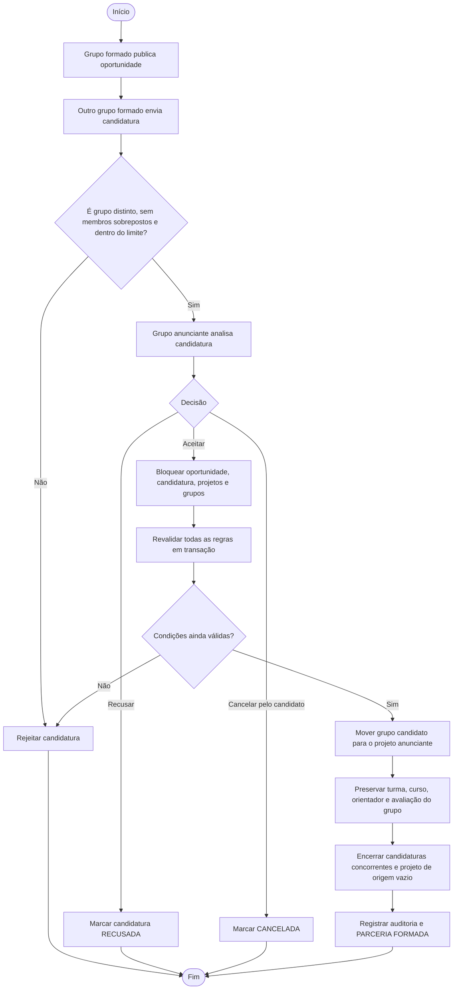

# Diagramas de Atividade

## UC-009 a UC-012 - Criação e aprovação inicial do projeto

## UC-005 a UC-007 - Inclusão ou transferência de aluno em sala

## UC-013 a UC-015 - Acompanhamento livre e marcos configuráveis

## UC-016 - Parceria interdisciplinar

