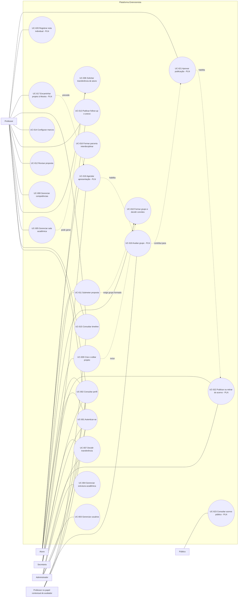

# Diagrama de Casos de Uso

## Observações

- “Professor”, “orientador” e “avaliador” não são subclasses rígidas. Orientador e avaliador são
  papéis contextuais, calculados pelo vínculo com sala, grupo, projeto ou atribuição.
- Casos marcados `PLN` derivam das regras aprovadas e do roadmap, mas ainda não constituem evidência
  de funcionalidade entregue.
- A matriz de rastreabilidade detalha a associação de cada caso com seus atores e restrições.
