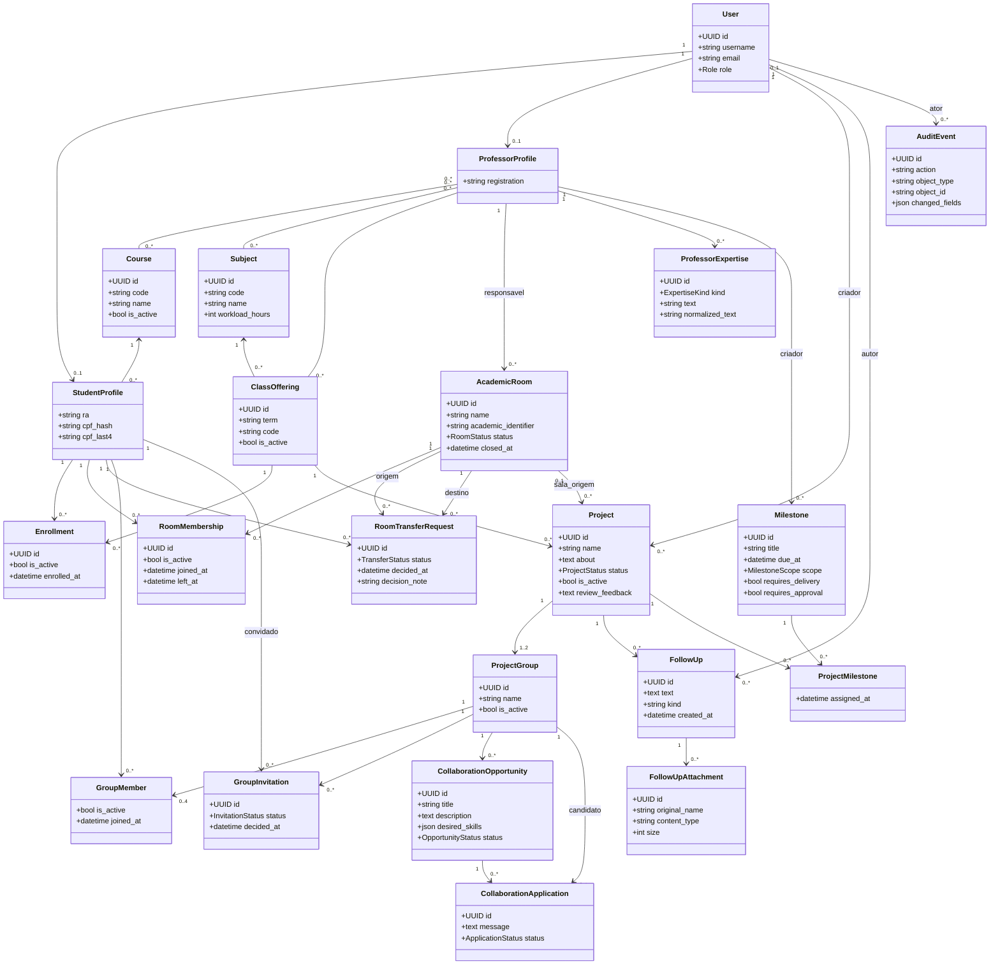

# Diagrama de Classes de Domínio

O diagrama apresenta as principais entidades implementadas até a Sprint 4.7. Campos técnicos e
métodos triviais foram omitidos para preservar legibilidade.

## Restrições estruturais importantes

- Um aluno possui no máximo um `RoomMembership` ativo.
- Um aluno possui no máximo uma `RoomTransferRequest` pendente.
- Convite pendente é único por grupo e convidado.
- O grupo mantém entre 2 e 4 integrantes quando formado; durante a composição pode conter apenas o criador.
- O projeto interdisciplinar possui no máximo dois grupos no MVP.
- Chaves externas críticas usam `PROTECT` para preservar o histórico acadêmico.
- `cpf_hash` é uma impressão criptográfica; o CPF integral não é persistido no perfil.
