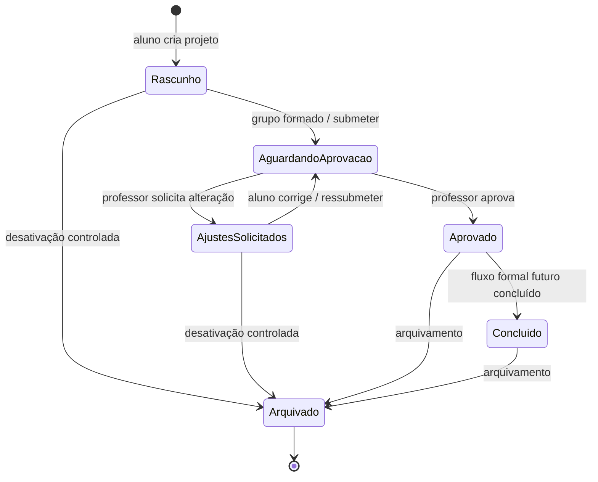
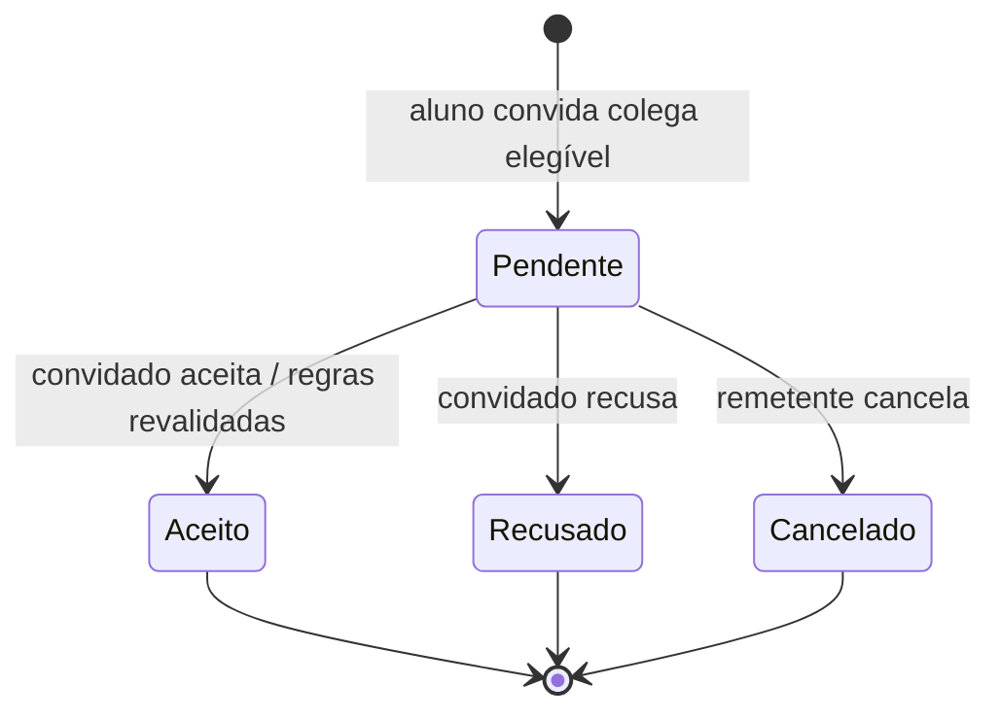
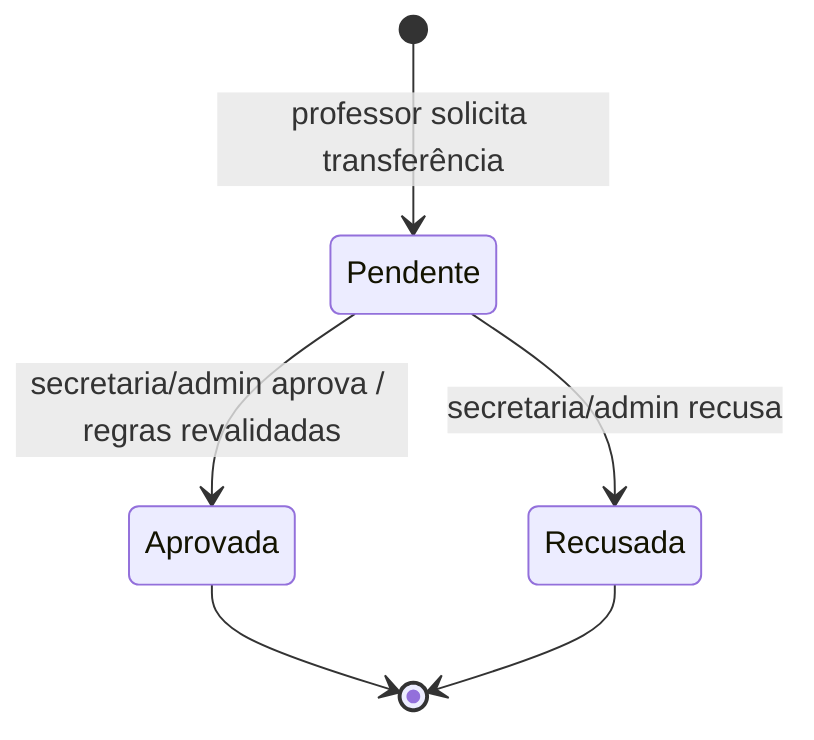
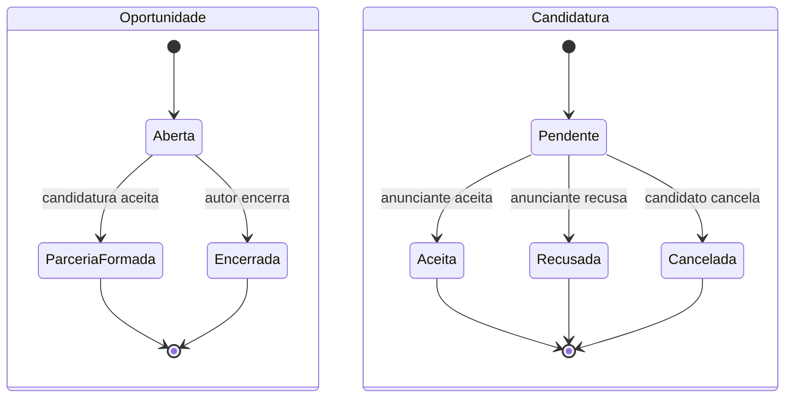
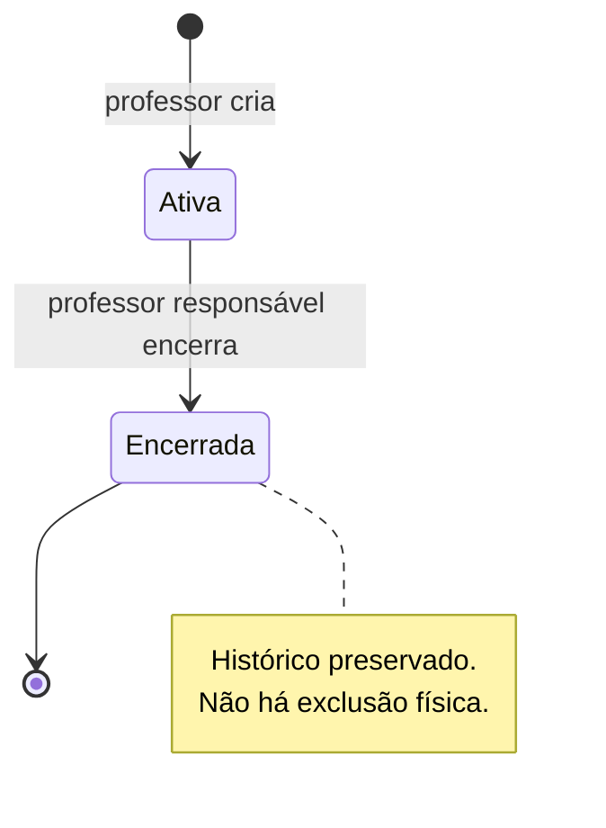

# Diagramas de Estados

## Projeto

```mermaid
stateDiagram-v2
  [*] --> Rascunho: aluno cria projeto
  Rascunho --> AguardandoAprovacao: grupo formado / submeter
  AguardandoAprovacao --> AjustesSolicitados: professor solicita alteração
  AjustesSolicitados --> AguardandoAprovacao: aluno corrige / ressubmeter
  AguardandoAprovacao --> Aprovado: professor aprova
  Aprovado --> Concluido: fluxo formal futuro concluído
  Rascunho --> Arquivado: desativação controlada
  AjustesSolicitados --> Arquivado: desativação controlada
  Aprovado --> Arquivado: arquivamento
  Concluido --> Arquivado: arquivamento
  Arquivado --> [*]
```

## Convite de grupo

```mermaid
stateDiagram-v2
  [*] --> Pendente: aluno convida colega elegível
  Pendente --> Aceito: convidado aceita / regras revalidadas
  Pendente --> Recusado: convidado recusa
  Pendente --> Cancelado: remetente cancela
  Aceito --> [*]
  Recusado --> [*]
  Cancelado --> [*]
```

## Solicitação de transferência de sala

```mermaid
stateDiagram-v2
  [*] --> Pendente: professor solicita transferência
  Pendente --> Aprovada: secretaria/admin aprova / regras revalidadas
  Pendente --> Recusada: secretaria/admin recusa
  Aprovada --> [*]
  Recusada --> [*]
```

## Oportunidade e candidatura interdisciplinar

```mermaid
stateDiagram-v2
  state Oportunidade {
    [*] --> Aberta
    Aberta --> ParceriaFormada: candidatura aceita
    Aberta --> Encerrada: autor encerra
    ParceriaFormada --> [*]
    Encerrada --> [*]
  }
  state Candidatura {
    [*] --> Pendente
    Pendente --> Aceita: anunciante aceita
    Pendente --> Recusada: anunciante recusa
    Pendente --> Cancelada: candidato cancela
    Aceita --> [*]
    Recusada --> [*]
    Cancelada --> [*]
  }
```

## Sala acadêmica

```mermaid
stateDiagram-v2
  [*] --> Ativa: professor cria
  Ativa --> Encerrada: professor responsável encerra
  Encerrada --> [*]
  note right of Encerrada
    Histórico preservado.
    Não há exclusão física.
  end note
```
